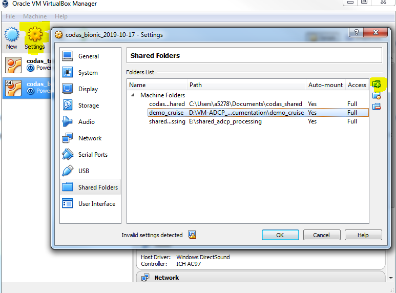
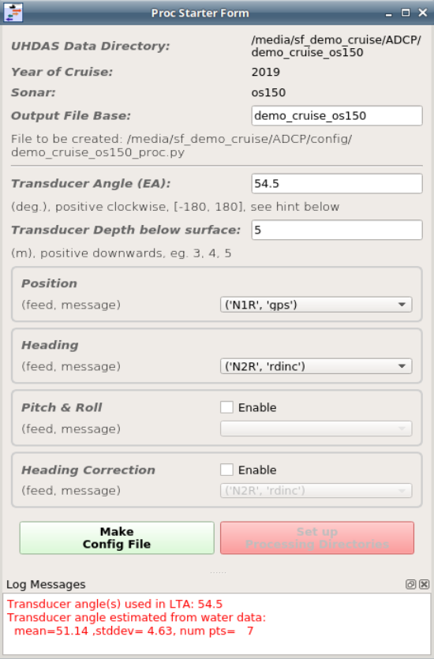
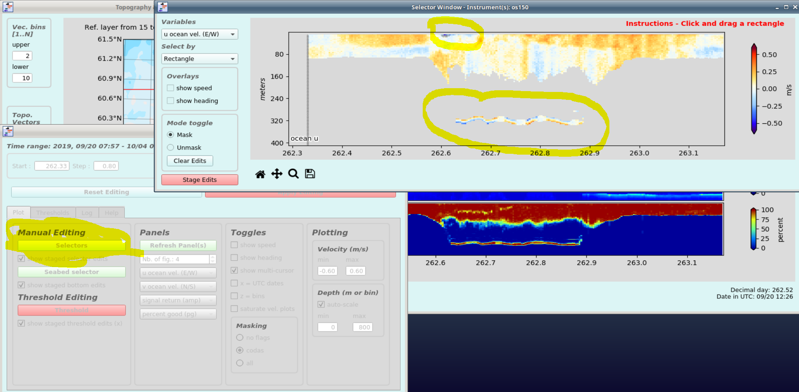
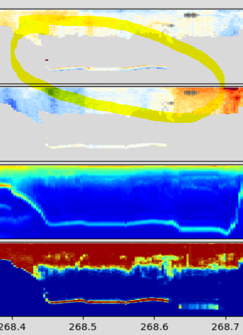
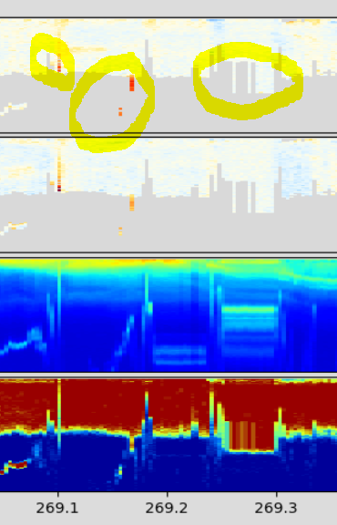
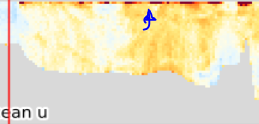
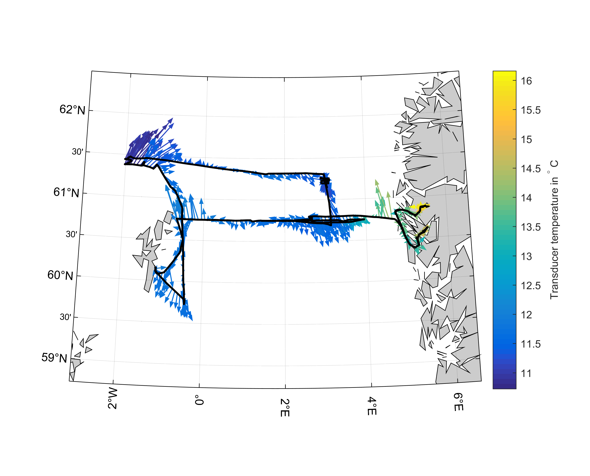
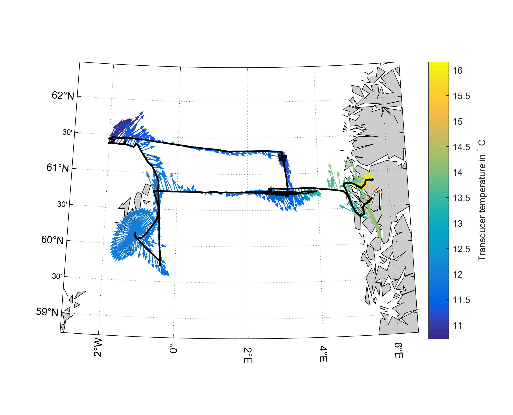
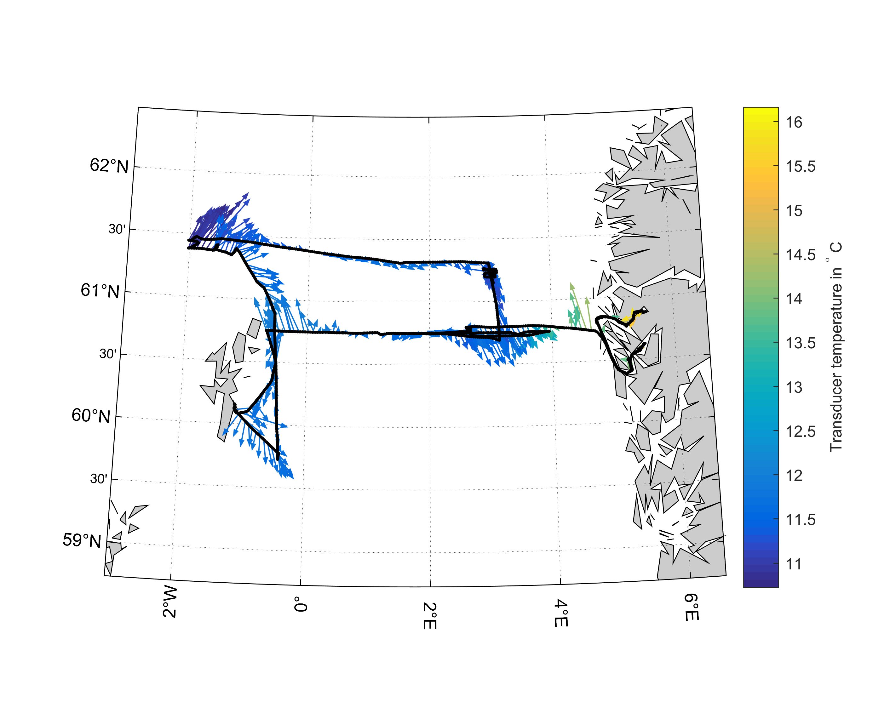
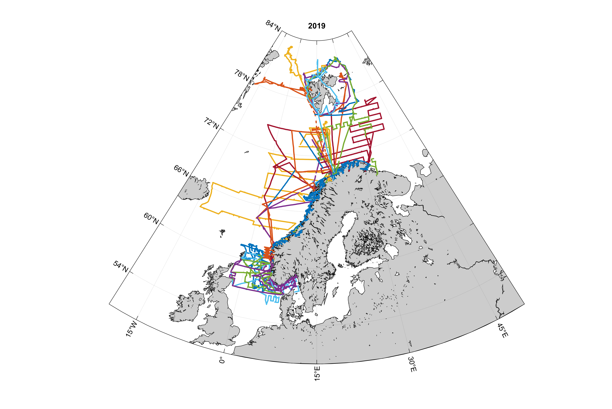

# Processing ADCP data from IMR vessels

All the large research vessels owned by the IMR have acoustic Doppler current profilers (ADCPs) mounted to their hull or a drop-keel (FF Kronprins Haakon has both). The raw ADCP data needs to be post-processed, this included correcting the current velocities for misalignment (rotation) of the ADCP with regard to the ships direction of travel, removal of noise from the sea floor, CTD, nets, echosounders, bubbles under the ship and ringing. 

ADCP data is recorded during approx. 50% of all cruises, as the ADCP is sometimes switched off to avoid interference with the echosounders. However, this interference can be avoided using triggerboxes (that should be installed and working on most ships) and setting suitable ping-intervals in the echosounder software. ADCP Interference in the echsounder data is usually visible as short vertical strips that form regular patterns in the echograms. 

ADCP data is gathered using either VM-DAS (the manufacturers software) or UH-DAS (from the University of Hawaii). When using VM-DAS, it is crucial to save the data in the .enr format together with the ships' NMEA navigation data (.N1R and .N2R files), so that a maximum amount of information is available for the post-processing. UH-DAS data is already recorded in a convenient format for post-processing with CODAS. Make sure that the PC that is gathering  ADCP data is running with the exact UTC time. If you can, synchronize the PC clock with a GPS device, the NMEA navigation data stream or the internet. Having the correct timestamps in the ADCP data is important for the post-processing

There are two data processing pathways depending on the format of the raw ADCP data. If .enr, .N1R and .N2R data from VM-DAS are used, we need to first convert these files into the UH DAS format. If UH-DAS data is used this step can be skipped. The flowchart below illustrates the main steps of the post-processing. The first step is to check the misalignment of the ADCP, then inspect and edit the data and export it as netcfd. The following sections explain the post-processing using an example cruise recorded with VM-DAS.


## Locating the raw VM-ADCP data

### Demonstration cruise

A demo VM-ADCP data set can be downloaded here: http://vedlegg.uib.no/?id=098379b05a30182a3211e9d34d9332f6. The zip file contains the folder structure `demo_cruise/ADCP/150_KHZ` that contains raw VM-DAS data. We will use this as a test cruise for this tutorial. Once this works, you can go on and process real cruises from the IMR server.

### ADCP data storage at IMR 

After each cruise, the ADCP data is copied onto the cruise server `\\ces.imr.no\cruise_data\`, usually into to a folder structure similar to this: `%CRUISE-ID_SHIP-ID% / PHYSICS / ADCP / %Frequency% /`. However, other folder structures are also found, so one has too use a file-walker algorithm that searches through the servers and locates the directories containing the raw ADCP data. My initial solution to this has been a Matlab function called `dirwalk` that can be downloaded here: https://se.mathworks.com/matlabcentral/fileexchange/32036-dirwalk-walk-the-directory-tree. Similar functions exists for python or shell scripts. The following Matlab code searches through all cruise folders from 2019, locates the folders containing ADCP data and copies them to a local drive:

```Matlab
imr=cell(1)
enrpaths=cell(1)

i_year=2019
cruisecounter=1;
enrcounter=1;

% for i_year=1980:2019
    
clear track adcp_available

cruise_folders=dir(['\\ces.imr.no\cruise_data\',num2str(i_year),'\']);

if numel(cruise_folders)>0
    
for i_cruise=1:numel(cruise_folders)
  
cruisename=cruise_folders(i_cruise).name;

if cruisename(1)=='.'
    continue
end
    
imr{cruisecounter,1}=cruisename;
[pathNames, ~,~] = dirwalk(['\\ces.imr.no\cruise_data\',num2str(i_year),'\',cruisename]);
adcpstr= strfind(pathNames,'ADCP');
i_adcp = find( ~cellfun('isempty', adcpstr) );

n_enr=0;
for i_folder=1:numel(i_adcp);
 disp( pathNames{i_adcp(i_folder)} )
enrstruct=dir( [ pathNames{i_adcp(i_folder)},'\*enr'  ]);
n_enr=n_enr+numel(enrstruct);
if n_enr>0
    enrpaths{enrcounter}=pathNames{i_adcp(i_folder)};
    enrcounter=enrcounter+1;
end
end

imr{cruisecounter,2}=n_enr;
cruisecounter=cruisecounter+1;
end
end
% end

%% throw out ladcp
ladcpcell=regexp(enrpaths,'\w*LADCP\w*') 
ix = ~cellfun('isempty', ladcpcell)
enrpaths(ix)=[];

%% copy to shared vm folder

for i_folder=1:numel(enrpaths)
    try
    source=enrpaths{i_folder};
    a=strsplit(enrpaths{i_folder},'cruise_data');
    destination=['E:\shared_adcp_processing',a{2}]
    mkdir(destination);
    copyfile(source,destination)
    end
end
```

## Post-processing using the CODAS environment

One of the best tools for ADCP post-processing is the CODAS environment developed at the University of Hawaii (https://currents.soest.hawaii.edu/docs/adcp_doc/index.html). The easiest way to use this software is to install a virtual UNIX machine using the software "Oracle VM VirtualBox" (https://www.virtualbox.org/) and the down-loadable VM image from the CODAS website (https://currents.soest.hawaii.edu/docs/adcp_doc/codas_setup/virtual_computer/codaspy/index.html). This sections contains a short tutorial, more detailed documentation on the CODAS post-processing can be found at: https://currents.soest.hawaii.edu/docs/adcp_doc/index.html. 

After installing the VirtualBox program, start it and load the CODAS image. Before starting up the CODAS virtual machine, open the Settings menu, navigate to "Shared folders" and add the `demo_cruise` folder.



Then start up the virtual machine and open a terminal and text editor. To process the demo_cruise VM-DAS data follow these steps.

### Processing VM-DAS data

In the terminal, change the work directory to the folder containing the raw ADCP data:

```
cd /media/sf_demo_cruise/ADCP
```

To convert the data into the UH-DAS format, enter the command:

```
adcp_database_maker.py
```

and follow the GUI instructions. Select the folder "150_KHZ", enter the cruise name "demo_cruise" and push the "Convert enr files" button.  This can take some time depending on the amount of ADCP data. Then push the buttons to make the conversion files, convert the data and set up the processing directories. When the form "Proc Starter Form" opens, enter the misalignment an depth of the ADCP. This is estimated by the CODAS software in the text box or can be taken from a table in this document. Then press the buttons "Make config files" and "Set up processing directories".



Then a new form will open. Here you can choose to process either broadband, normal or if available narrowband data. I would go for narrowband data if available. To do so locate the pane termed "os150nb" or "os150" at the top of the form and then press the colored buttons one after the other.


Once this is finished you can close the form and navigate into a processing directory created by CODAS: 

```
cd  /media/sf_demo_cruise/ADCP/os150_ENR
```

To check the misalignment in the terminal enter:

```
tail -20 cal/watertrk/adcpcal.out
```

This will give you the misalignment angle (phase) and amplitude as estimated using the ships navigation data:

```
codaspy:(os150_ENR)-PY3$ tail -20 cal/watertrk/adcpcal.out
 ADCP watertrack calibration
##
 Time range 262.57 to 276.14
   Calculation done at Wed Mar 11 12:38:22 2020
   delta-u min = -100.00, max = 100.00
   delta-v min = -100.00, max = 100.00
   clip_amp = 0.04,  clip_ph =  3.0
   clip_dt =   60,  clip_var = 0.050
Number of edited points: 105 out of 117
   amp   = 1.0156  + -0.0002 (t - 268.3)
   phase =   1.63  + -0.0310 (t - 268.3)
            median     mean      std
amplitude   1.0140   1.0156   0.0118
phase       1.5940   1.6328   0.5868
nav - pc    7.0000   6.5048   6.5385
var         0.0070   0.0078   0.0049
min var     0.0050   0.0059   0.0036
delta-u     0.5800   0.2018   4.2722
delta-v     0.1100   0.5263   2.6657
```

The amplitude should be 1 and the phase/angle 0. To correct the misalignment and rotate the data use this command with the phase and amplitude values just obtained:

```
quick_adcp.py --steps2rerun rotate:apply_edit:navsteps:calib --rotate_amplitude 1.0156 --rotate_angle  1.63   --auto
```

Now we can check the misalignment again and find good values:

```
codaspy:(os150_ENR)-PY3$ tail -20 cal/watertrk/adcpcal.out
 ADCP watertrack calibration
##
 Time range 262.57 to 276.14
   Calculation done at Wed Mar 11 12:50:25 2020
   delta-u min = -100.00, max = 100.00
   delta-v min = -100.00, max = 100.00
   clip_amp = 0.04,  clip_ph =  3.0
   clip_dt =   60,  clip_var = 0.050
Number of edited points: 106 out of 118
   amp   = 1.0004  + -0.0001 (t - 268.3)
   phase =   0.00  + -0.0311 (t - 268.3)
            median     mean      std
amplitude   0.9990   1.0004   0.0116
phase      -0.0370   0.0041   0.5861
nav - pc    3.0000   3.9623   4.2782
var         0.0020   0.0029   0.0031
min var     0.0020   0.0021   0.0021
delta-u     0.5450   0.1806   4.2631
delta-v     0.1000   0.5005   2.6664
```

Sometimes CODAS does not generate the "adcpcal.out" file automatically. If this is the case try to run the correction command with default values (1 and 0):   `quick_adcp.py --steps2rerun rotate:apply_edit:navsteps:calib --rotate_amplitude 1 --rotate_angle 0 --auto`

**As part of the processing, the default of CODAS is to average the data into 5 min temporal bins**. This makes sense for most ADCP datasets and reduces noise, I would those not change the averaging. However, if your desire different bins, you can open the file  `demo_cruise\ADCP\os150_ENR\q_py.cnt`and set the values of   `--ens_len 300  ## averages of 300sec` duration to your desired temporal bin length.  Then you need to rerun the command: `quick_adcp.py --steps2rerun rotate:apply_edit:navsteps:calib --auto`. The depth bins of the ADCP dataset depend on the settings and frequency of the ADCP, here CODAS will automatically choose appropriate bin sizes. 

The next step is to visually inspect the data for interference, bottom and bubble artifacts and ringing. To do this enter the following command into the terminal:

```
dataviewer.py -e
```

A GUI will open that shows a map of track and arrows, u and v velocity and amplitude sections and a steering panel. The goal of this stage is to remove erroneous ADCP data that the automatic bottom detection and thresholding algorithms could not detect.  Bad data that shoyuld be removed is marked with gray circles in the sections on the right hand side. To edit out data manually click the "Selectors" button, then a new window will open where you can encircle bad data. An example is given in the screenshot below. Here bad data from bottom reflections needs to be removed manually. Once you marked the bad parts using the rectangle or lasso tool, click "stage edits" and then the "Apply editing" button on the steering panel. Once you are down with that part of the dataset, click on the rightward arrow and repeat the editing if necessary. 



Examples for common artifacts are:

bottom interference / false echoes 


and erroneous profiles 

ringing or bubbles under the ship: 

More detailed information on ADCP data artifacts can be found here: https://currents.soest.hawaii.edu/docs/adcp_doc/ADCP_INTERPRETATION/index.html. Once you have inspected and cleaned the entire cruise you can close the GUI and apply the changes by entering this command into the terminal:

```
quick_adcp.py --steps2rerun apply_edit:navsteps:calib --auto
```

Then the data can be exported as a netcdf with this command:

```
adcp_nc.py adcpdb contour/os150 test os150
```

The netcdf file `os150.nc` can now be found in the folder `demo_cruise/ADCP/os150_ENR/contour/os150`. It has the following structure:

```
data_struct = 
          time: [3929x1 double]
           lon: [3929x1 double]
           lat: [3929x1 double]
         depth: [100x3929 double]
             u: [100x3929 double]
             v: [100x3929 double]
           amp: [100x3929 int16]
            pg: [100x3929 int8]
         pflag: [100x3929 int8]
       heading: [3929x1 double]
       tr_temp: [3929x1 double]
     num_pings: [3929x1 int16]
         uship: [3929x1 double]
         vship: [3929x1 double]
```

A summary of the UNIX commands used for the processing is given in the box below. I suggest to create a .txt file containing these commands for every cruise, so you only have to update the folder locations for each cruise.

```shell
# open terminal
# cd into right project directory
cd  /media/sf_demo_cruise/ADCP

# convert enr files and enter cruisname
adcp_database_maker.py
# follow gui and remember to type in the correct directories

cd  /media/sf_demo_cruise/ADCP/os150_ENR
tail -20 cal/watertrk/adcpcal.out

# check if misalingment is ok (amp=1 and phase=0)
# if not changes with
# quick_adcp.py --steps2rerun rotate:apply_edit:navsteps:calib --rotate_amplitude 1 --rotate_angle  0 --auto

# edit data
dataviewer.py -e
quick_adcp.py --steps2rerun apply_edit:navsteps:calib --auto

# export netcdf
adcp_nc.py adcpdb contour/os150 test os150
```


### Processing UH-DAS data

For UH-DAS data (so far only from FF Kristine Bonnevie) you can leave out the conversion step and begin directly by checking the misalignment and then proceed to the visual inspection. This mean following the same steps as described above: 

```shell
cd /media/sf_shared_adcp_processing/2019/S2019604_PKRISTINEBONNEVIE_1172/PHYSICS/ADCP/150_KHZ/proc/os150nb

tail -20 cal/watertrk/adcpcal.out

# check if misalingment is ok (amp=1 and phase=0)
# if not changes with
# quick_adcp.py --steps2rerun rotate:apply_edit:navsteps:calib --rotate_amplitude 1 --rotate_angle  0   --auto

# edit data
dataviewer.py -e

quick_adcp.py --steps2rerun apply_edit:navsteps:calib --auto

adcp_nc.py adcpdb contour/os150nb test os150nb
```

### Typical misalignment and amplitude correction factors

These are the current misalignment angles of the IMR vessels. They can change over time, when the ADCPs are moved during maintenance work. It is this important to check the watertrack calibration during each post processing.

| Vessel               | Vessel ID | ADCP Frequency | Misalignment angle | Cruise numbers for for which misalignment data was available |
| -------------------- | --------- | -------------- | ------------------ | ------------------------------------------------------------ |
| FF Johan Hjort       | 1019      | 75 kHz         | -26.4              | 2019201	2019202	2019203	2019204	2019205	2019208	2019211	2019212 |
| FF Kristine Bonnevie | 1172      | 150 kHz        | 45                 | 2019601	2019602	2019603	2019604	2019605	2019606	2019607	2019609	2019612	2019613	2019615	2019616	2019618	2019619	2019621	2019622	2019623	2019625	2019629	2019630	2019631	2019633 |
| FF Helmer Hanssen    | 1173      | 75 kHz         | 1.8                | 2019813                                                      |
| FF G O Sars          | 4174      | 75 kHz         | 39.7               | 2019102	2019106	2019107	2019110	2019111	2019112	2019113	2019115 |
| FF G O Sars          | 4174      | 150 kHz        | 53.3               | 2019111	2019114	2019115	2019118                     |
| FF Kronprins Haakon  | 9566      | 38 kHz         | 38.4               | 2019701	2019702	2019703	2019707	2019708	2019710 |
| FF Kronprins Haakon  | 9566      | 150 kHz        | 46.5               | 2019702	2019706	2019708	2019710	2019711          |

## Mapping the demo cruise

To map the demo cruise with Matlab we need to first read the netcdf file:

```Matlab

filename='D:\VM-ADCP_documentation\demo_cruise\ADCP\os150_ENR\contour\os150.nc'

info=ncinfo(filename);
clear data_struct

for i=1:size(info.Variables,2)
   variables_to_load{i}=info.Variables(i).Name;
end

% loop over the variables
for j=1:numel(variables_to_load)
    % extract the jth variable (type = string)
    var = variables_to_load{j};

    % use dynamic field name to add this to the structure
    data_struct.(var) = ncread(filename,var);

    % convert from single to double, if that matters to you (it does to me)
    if isa(data_struct.(var),'single')
        data_struct.(var) = double(data_struct.(var));
    end
end

data_struct.u(data_struct.u>10)=NaN;
data_struct.v(data_struct.v>10)=NaN;
data_struct.lat(data_struct.lat>100)=NaN;
data_struct.lon(data_struct.lon>400)=NaN;
data_struct.depth(data_struct.depth>15000)=NaN;
```

Then we can map the depth-averaged current vectors along the cruise track using the m_map package ( https://www.eoas.ubc.ca/~rich/map.html). Make sure the the m_map directory is added to the current paths.

```Matlab
addpath(genpath('C:\Users\a5278\Documents\MATLAB\matlab_functions'))

latlim=[min(data_struct.lat)-1 max(data_struct.lat)+1];
lonlim=[min(data_struct.lon)-1 max(data_struct.lon)+1];

figure(3)
clf
set(gcf,'color',[1 1 1])
hold on
m_proj('lambert','long',lonlim,'lat',latlim);
m_gshhs_l('patch',[.8 .8 .8]);
 m_grid('xlabeldir','end','fontsize',10);
 
m_vec(1,data_struct.lon(1:3:end),data_struct.lat(1:3:end),mean(data_struct.u(:,1:3:end),'omitnan'),mean(data_struct.v(:,1:3:end),'omitnan'),data_struct.tr_temp(1:3:end),'shaftwidth', .8, 'headangle', 35, 'edgeclip', 'on')

cb=colorbar
ylabel(cb,'Transducer temperature in ^{\circ} C')
m_plot(data_struct.lon,data_struct.lat,'.k')
```

This will produce this map: 


These ADCP profiles show the instantaneous current at a given given place and time. In areas with strong tides, it is useful to subtract tidal currents from the observed current velocities, to study only the residual flow. Especially if one is interested in the transport of particles and water masses, it is important to remove tidal currents, as these can obscure transport and circulation patterns. If there are many ADCP profiles (measured at different times) at the same location, it is possible to extract the local tidal constitutions from the ADCP data using harmonic analysis. A good a example of this is given in:

Vindenes, H., Orvik, K. A., Søiland, H., & Wehde, H. (2018). Analysis of tidal currents in the North Sea from shipboard acoustic Doppler current profiler data. Continental Shelf Research, 162(February), 1–12. https://doi.org/10.1016/j.csr.2018.04.001

If the data is very scattered in time and space (as is common for most cruises), harmonic analysis becomes difficult to impossible. Here tidal models can be used to predict the tides along the cruise track. 

## De-tiding using tidal models (experimental)

Many different global and regional tidal models exists. As a first test I used regional models for the Atlantic and Arctic Ocean, that can be found here: http://volkov.oce.orst.edu/tides/region.html. To predict tides from the Model Atlas files,  fortran or Matlab functions are available. The Matlab functions can be found here: https://www.esr.org/research/polar-tide-models/tmd-software/. Once the TMD matlab folder is added to the working environment, and the model files are added to the `DATA` sub-folder, the u and v components of the tides along the cruise track can be predicted using the following code:

```Matlab
%%%%%%%%%%% detide

clear tide
addpath(genpath('C:\Users\a5278\Documents\MATLAB\tidal_model'))
Model='C:\Users\a5278\Documents\MATLAB\tidal_model\aotim5_tmd\Model_AOTIM5';
[tide.u_arc,a]=tmd_tide_pred(Model,data_struct.time,data_struct.lat,data_struct.lon,'u',[]);
[tide.v_arc,a]=tmd_tide_pred(Model,data_struct.time,data_struct.lat,data_struct.lon,'v',[]);

Model='C:\Users\a5278\Documents\MATLAB\tidal_model\atlantic\Model_AO';
[tide.u_atl,a]=tmd_tide_pred(Model,data_struct.time,data_struct.lat,data_struct.lon,'u',[]);
[tide.v_atl,a]=tmd_tide_pred(Model,data_struct.time,data_struct.lat,data_struct.lon,'v',[]);

tide.u_arc=tide.u_arc./100;
tide.v_arc=tide.v_arc./100;
tide.u_atl=tide.u_atl./100;
tide.v_atl=tide.v_atl./100;

tide.u=tide.u_arc;
tide.u(isnan(tide.u))=tide.u_atl(isnan(tide.u));
tide.v=tide.u_arc;
tide.v(isnan(tide.v))=tide.v_atl(isnan(tide.v));

data_struct.u_detide=data_struct.u - repmat(tide.u,[ size(data_struct.u,1),1 ]) ;
data_struct.v_detide=data_struct.v - repmat(tide.v,[ size(data_struct.v,1),1 ]) ;

```

The de-tided current data then looks like this:



The de-tided current vectors look reasonable in deep waters and on the shelf, but close to the coast (near Shetland and the Fjords) the tidal model predictions produce messy and potentially faulty predictions. The tidal models are not optimized for fjords and complex coastal geography, thus i am using the following routine to cut out de-tided ADCP data close to land,  by deleting data points in locations shallower than 10 m depth. Depth is derived from the global ETOPO-1 dataset that can be downloaded here: https://www.ngdc.noaa.gov/mgg/global/.

```matlab
%% cut out data close to land using Etopo 1 depth data

latlim=[min(data_struct.lat)-1 max(data_struct.lat)+1];
lonlim=[min(data_struct.lon)-1 max(data_struct.lon)+1];

[Z, refvec] = etopo('C:\Users\a5278\Documents\MATLAB\ETOPO\etopo1_ice_c_f4.flt', 1, latlim, lonlim);

depth_threshold=-10;

data_struct.bottomdepth = ltln2val(Z, refvec, data_struct.lat, data_struct.lon);

data_struct.u_detide_clean=data_struct.u_detide;
data_struct.v_detide_clean=data_struct.v_detide;

ix=data_struct.bottomdepth>depth_threshold;
data_struct.u_detide_clean(:,ix)=NaN([100,sum(ix)]);
data_struct.v_detide_clean(:,ix)=NaN([100,sum(ix)]);

%% map it
addpath(genpath('C:\Users\a5278\Documents\MATLAB\matlab_functions'))

latlim=[min(data_struct.lat)-1 max(data_struct.lat)+1];
lonlim=[min(data_struct.lon)-1 max(data_struct.lon)+1];

figure(3)
clf
set(gcf,'color',[1 1 1])
hold on
m_proj('lambert','long',lonlim,'lat',latlim);
m_gshhs_l('patch',[.8 .8 .8]);
 m_grid('xlabeldir','end','fontsize',10);
 
m_vec(1,data_struct.lon(1:3:end),data_struct.lat(1:3:end),mean(data_struct.u_detide_clean(:,1:3:end),'omitnan'),mean(data_struct.v_detide_clean(:,1:3:end),'omitnan'),data_struct.tr_temp(1:3:end),'shaftwidth', .8, 'headangle', 35, 'edgeclip', 'on')

cb=colorbar
ylabel(cb,'Transducer temperature in ^{\circ} C')
m_plot(data_struct.lon,data_struct.lat,'.k')

%   print(gcf,'-dpng',['vmadcp_map_vectors_detide_clean'],'-r400') 
```

The cleaned de-tided ADCP data now look like this:



## Collecting and plotting the netcdf files

Once you have processed a number of cruises, you can use the following Matlab scripts to gain an overview and check the processed ADCP data I used Matlab to locate the .nc files and plot maps and current vectors. 


```Matlab
 [pathNames, ~,~] = dirwalk(['E:\shared_adcp_processing\2019']);
%% find ncfiles

k=1
for i_folder=1:numel(pathNames);
%  disp( pathNames{i_folder} )
nc_struct=dir( [ pathNames{i_folder},'\*.nc'  ]);
if ~isempty(nc_struct)
nc_paths{k}=[ pathNames{i_folder},'\',nc_struct(1).name]
k=k+1;
end

end
%% load tracks

allnc.lat=[];
allnc.lon=[];
allnc.time=[];
allnc.cruiseid=[];
allnc.umean=[];
allnc.vmean=[];

for i_nc=1:numel(nc_paths);

filename=nc_paths{i_nc};
 info=ncinfo(filename)
clear data_struct

a= regexp(filename,'2019\');
data_struct.cruiseid=str2num(filename(a+6:a+12));

for i=1:size(info.Variables,2)
   variables_to_load{i}=info.Variables(i).Name;
end

% loop over the variables
for j=1:numel(variables_to_load)
    % extract the jth variable (type = string)
    var = variables_to_load{j};

    % use dynamic field name to add this to the structure
    data_struct.(var) = ncread(filename,var);

    % convert from single to double, if that matters to you (it does to me)
    if isa(data_struct.(var),'single')
        data_struct.(var) = double(data_struct.(var));
    end
end

data_struct.u(data_struct.u>10)=NaN;
data_struct.v(data_struct.v>10)=NaN;
data_struct.lat(data_struct.lat>100)=NaN;
data_struct.lon(data_struct.lon>400)=NaN;
data_struct.depth(data_struct.depth>15000)=NaN;

date=datenum(2019,0,data_struct.time); 
% dv=datevec(date); 

allnc.umean=[allnc.umean;mean(data_struct.u,'omitnan')']
allnc.vmean=[allnc.vmean;mean(data_struct.v,'omitnan')']

allnc.lat=[allnc.lat;data_struct.lat]
allnc.lon=[allnc.lon;data_struct.lon]
allnc.time=[allnc.time;date]
allnc.cruiseid=[allnc.cruiseid;ones(size(data_struct.lat))*data_struct.cruiseid ]
end
```

The data can be mapped using the m_map package https://www.eoas.ubc.ca/~rich/map.html

```Matlab
figure(3)
clf
set(gcf,'color',[1 1 1])
hold on
m_proj('lambert','long',lonlim,'lat',latlim);
m_gshhs_l('patch',[.8 .8 .8]);
 m_grid('xlabeldir','end','fontsize',10);
 
m_vec(10,allnc.lon(1:10:end),allnc.lat(1:10:end),allnc.umean(1:10:end),allnc.vmean(1:10:end),sqrt(allnc.umean(1:10:end).^2+allnc.vmean(1:10:end).^2),'shaftwidth', .7, 'headangle', 25, 'edgeclip', 'on')
 set(gca,'clim',[0,1])
cb=colorbar
ylabel(cb,'Transducer temperature in ^{\circ} C')

title('2019')

%   print(gcf,'-dpng',['vm-adcp-2019_all'],'-r500') 
```

This map shows the locations of all processed ADCP profiles available in 2019:


